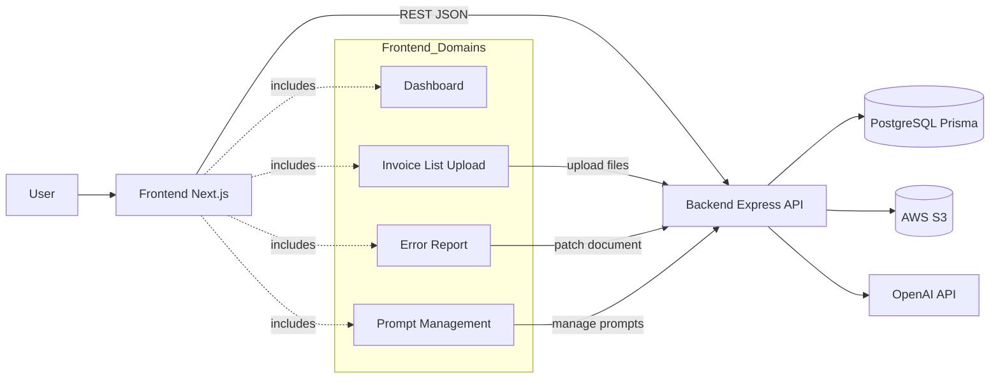
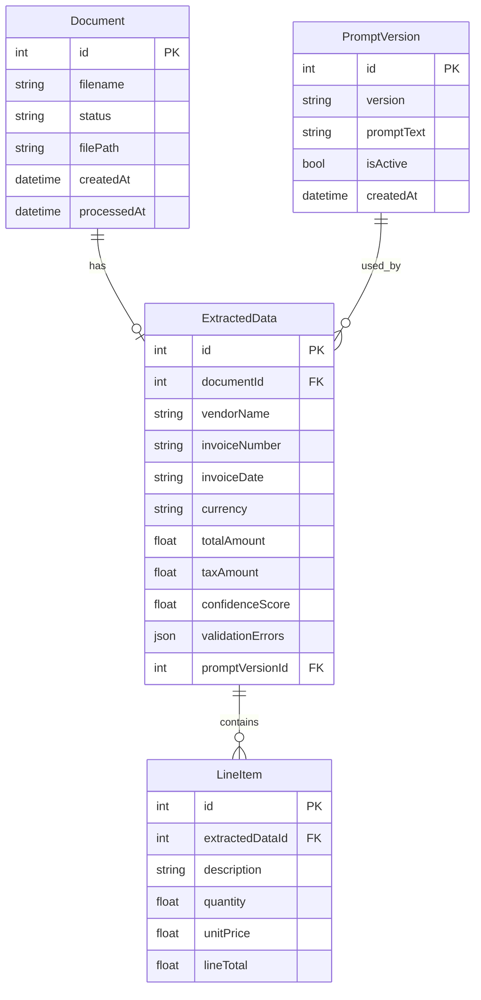
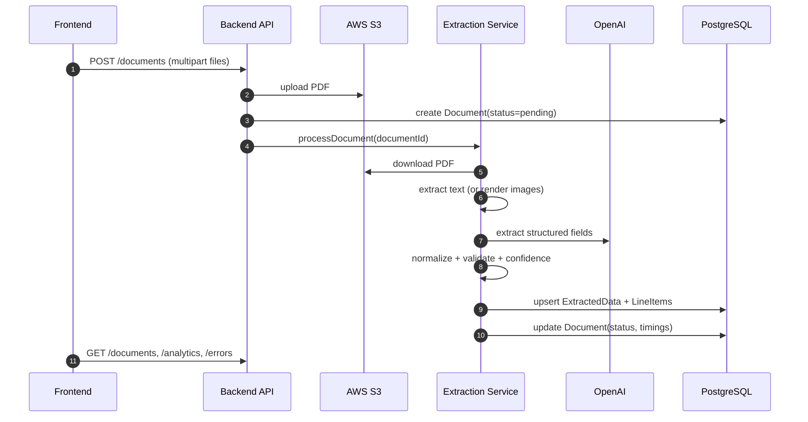

# Invoice Intelligence System

Full-stack application for uploading invoice PDFs, extracting structured fields, tracking processing quality, handling validation errors, and managing prompt versions.

## Tech Stack

- Frontend: Next.js (App Router), React, TypeScript, Tailwind CSS, React Query, Recharts, React Dropzone
- Backend: Node.js, Express, Prisma ORM, PostgreSQL, OpenAI SDK, AWS S3
- Tooling: ESLint, TypeScript, Nodemon, Prisma Migrate/Studio

## Monorepo Structure

```text
.
├─ frontend/                 # Next.js app (port 3001)
│  └─ src/
│     ├─ app/                # App Router entry/layout/providers
│     ├─ components/         # UI views and shared components
│     ├─ features/           # domain hooks (documents/errors/prompts/analytics)
│     └─ lib/api/            # typed API client
└─ backend/                  # Express + Prisma API (port 3000)
   ├─ prisma/                # schema, migrations, seed
   └─ src/
      ├─ routes/             # API route declarations
      ├─ controllers/        # request orchestration
      ├─ services/           # extraction, PDF, S3, validation
      ├─ mappers/            # response mapping
      ├─ middleware/         # upload + error handlers
      └─ utils/              # shared helpers (prisma, pagination)
```

## Architecture Diagram



## Data Model (Prisma)



## Setup Instructions

### Prerequisites

- Node.js 20+
- npm 10+
- PostgreSQL database (or Neon/Postgres-compatible URL)
- AWS S3 bucket and credentials
- OpenAI API key

### 1) Clone and Install

```bash
git clone <your-repo-url>
cd "AI Document Intelligence System"

cd backend && npm install
cd ../frontend && npm install
```

### 2) Configure Environment Variables

Create `backend/.env.local`:

```env
PORT=3000
DATABASE_URL=postgresql://<user>:<password>@<host>:<port>/<db>?schema=public
OPENAI_API_KEY=<your_openai_key>
AWS_ACCESS_KEY_ID=<your_aws_key_id>
AWS_SECRET_ACCESS_KEY=<your_aws_secret>
AWS_REGION=<your_region>
S3_BUCKET_NAME=<your_bucket_name>
```

Create `frontend/.env.local`:

```env
NEXT_PUBLIC_API_BASE_URL=http://localhost:3000
```

### 3) Prepare Database

```bash
cd backend
npm run db:migrate
npm run db:seed
```

### 4) Run the Apps

Terminal 1:

```bash
cd backend
npm run dev
```

Terminal 2:

```bash
cd frontend
npm run dev
```

Open: `http://localhost:3001`

## API Reference

Base URL: `http://localhost:3000`

### Documents

- `POST /documents`
  - multipart upload, field: `files[]` (single or multiple PDFs)
  - response: uploaded document summaries
- `GET /documents?page=<n>&limit=<n>&status=<status>&hasErrors=true`
  - list and filter documents
- `GET /documents/:id`
  - full document detail with extracted data and line items
- `PATCH /documents/:id`
  - manual correction payload (partial):
  - `vendor_name`, `invoice_number`, `invoice_date`, `currency`, `total_amount`, `tax_amount`
- `POST /documents/reprocess/:id`
  - optional body: `{ "prompt_version_id": number }`

### Errors

- `GET /errors?page=<n>&limit=<n>`
  - list failed and processed_with_errors documents
- `GET /errors/analytics`
  - error type breakdown and most missing fields

### Prompts

- `POST /prompts`
  - body: `{ "version": "vX", "prompt_text": "..." }`
- `GET /prompts`
  - list prompt versions
- `GET /prompts/dropdown`
  - lightweight prompt list for selectors
- `PATCH /prompts/:id/activate`
  - activates one prompt and deactivates others

### Analytics

- `GET /analytics`
  - dashboard metrics including confidence distribution and throughput

## Technical Implementation

### Processing Flow



### Frontend Pattern

- React Query hooks are organized by domain in `frontend/src/features/*/hooks.ts`.
- Dashboard orchestrates views (`dashboard`, `invoices`, `error-report`, `prompts`) and composes data from hooks.
- Upload uses `react-dropzone` and sends `multipart/form-data` to `/documents`.
- API client in `frontend/src/lib/api/client.ts` centralizes base URL, error handling, and JSON/form requests.

### Backend Pattern

- Route layer defines endpoints and delegates to controllers.
- Controllers validate request inputs and orchestrate services and mappers.
- `extraction.service.js` drives the pipeline:
  - load PDF from S3
  - choose text or image extraction path
  - call OpenAI extraction
  - normalize/validate output and compute confidence
  - persist results atomically with Prisma transactions
- Errors are normalized through middleware in `backend/src/middleware/error.middleware.js`.

## Useful Commands

Backend:

```bash
npm run dev
npm run db:migrate
npm run db:seed
npm run db:studio
```

Frontend:

```bash
npm run dev
npm run build
npm run lint
npm run typecheck
```
